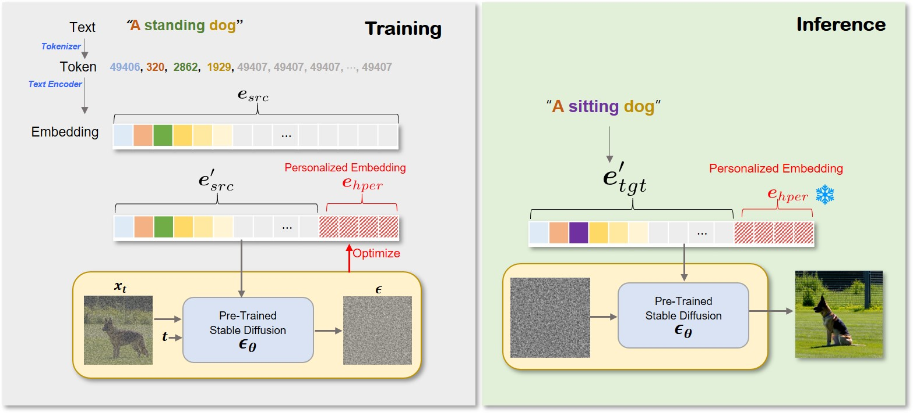

# Highly Personalized Text Embedding for Image Manipulation by Stable Diffusion

[](https://arxiv.org/abs/2303.08767)
[](https://hiper0.github.io/)

<!---Project Page: <https://hiper0.github.io/>--->

<p align="center">
  
</p>

## Abstract
> Diffusion models have shown superior performance in image generation and manipulation, but the inherent stochasticity presents challenges in preserving and manipulating image content and identity. While previous approaches like DreamBooth and Textual Inversion have proposed model or latent representation personalization to maintain the content, their reliance on multiple reference images and complex training limits their practicality. In this paper, we present a simple yet highly effective approach to personalization using highly personalized (HiPer) text embedding by decomposing the CLIP embedding space for personalization and content manipulation. Our method does not require model fine-tuning or identifiers, yet still enables manipulation of background, texture, and motion with just a single image and target text. Through experiments on diverse target texts, we demonstrate that our approach produces highly personalized and complex semantic image edits across a wide range of tasks. We believe that the novel understanding of the text embedding space presented in this work has the potential to inspire further research across various tasks.


## Environment
**Python** 3.8.5 \
**Torch** 1.11.0 
```
$ conda env create -f environment.yml
$ conda activate hiper
```
Our source code relies on [Imagic](https://huggingface.co/spaces/fffiloni/imagic-stable-diffusion).

## Optimize text embedding
In order to optimize the personalized embedding for a source image, run:
```
python train.py --pretrained_model_name 'CompVis/stable-diffusion-v1-4' --input_image 'dog2_standing.png' --target_text 'a sitting dog' --source_text 'a standing dog' --output_dir './standing_dog' --n_hiper=5 --emb_learning_rate=5e-3 --emb_train_steps=1200 --seed 200000
```
+ The text prompt for inference is given to the flag ```--target_text```
+ The text prompt describing a source image is given in the flag ```--source_text```
+ The flag ```--n_hiper``` controls the number of tokens to be personalized
+ The flag ```--emb_train_steps``` controls the number of iterations for optimization

## Inference with target text
In order to edit the source image using the personalized embedding, run:
```
python inference.py --pretrained_model_name 'CompVis/stable-diffusion-v1-4' --inference_train_step 1000 --target_txt 'a sitting dog' --output_dir './standing_dog' --seed 111111 --image_num 10
```
+ The text prompt for inference is given to the flag ```--target_text```
+ The flag ```--inference_train_step``` controls which the personalized embedding will be loaded
+ The flag ```--image_num``` controls the number of generated image

## BibTeX
```
@article{han2023highly,
      title={Highly Personalized Text Embedding for Image Manipulation by Stable Diffusion},
      author={Han, Inhwa and Yang, Serin and Kwon, Taesung and Ye, Jong Chul},
      journal={arXiv preprint arXiv:2303.08767},
      year={2023}
}
```
